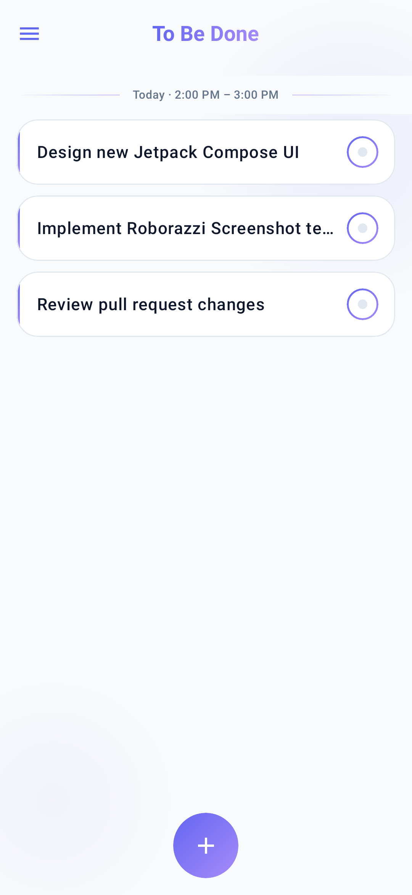
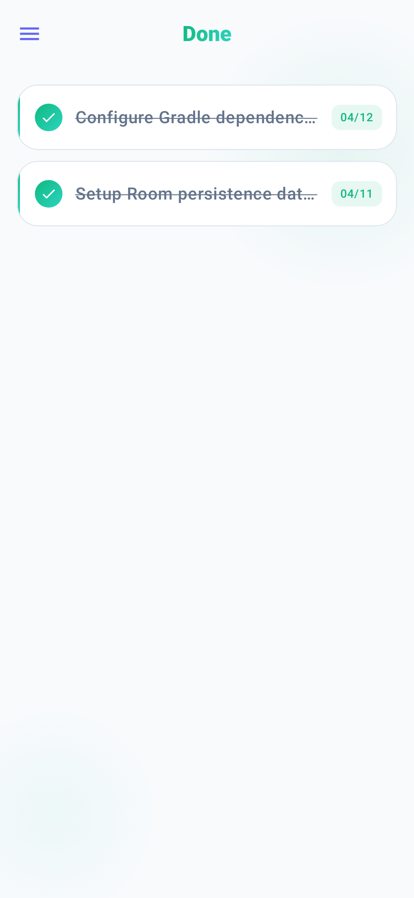
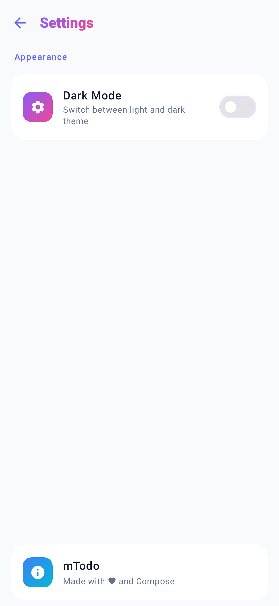
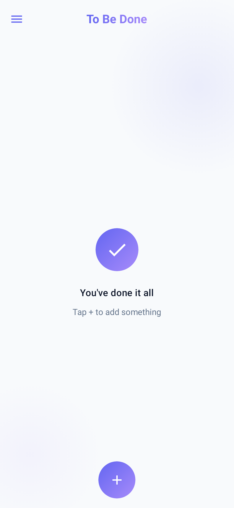
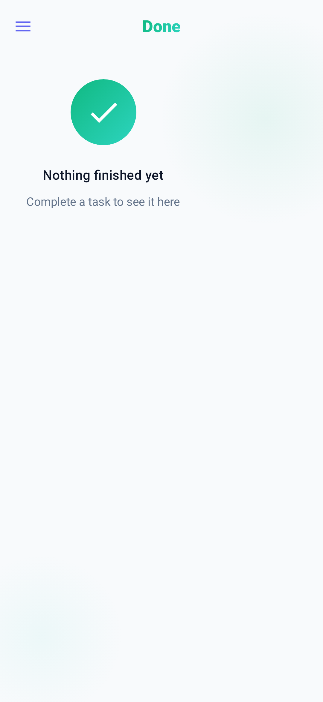
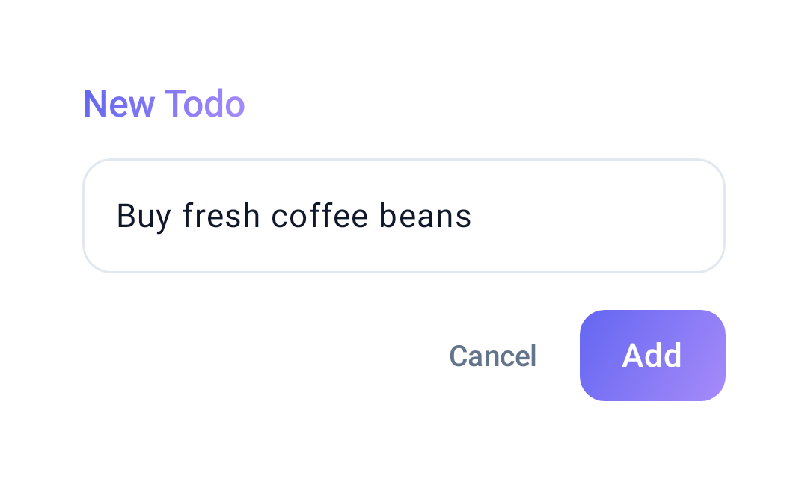

# mTodo

A modern, minimalist, and lightweight Todo app for Android built entirely with **Jetpack Compose** and **Material 3**.

<p align="center">
  
  
  
  
</p>

---

## 📸 Screenshots

<p align="center">
  
  &nbsp;&nbsp;
  
  &nbsp;&nbsp;
  
</p>

<p align="center">
  
  &nbsp;&nbsp;
  
  &nbsp;&nbsp;
  
</p>

---

## ✨ Features

- **Modern Jetpack Compose UI**: 100% declarative UI built with Material 3, dynamic cards, and soft indigo/violet accents.
- **Smart Date Segmentation**: Automatically groups active tasks into **Today**, **Yesterday**, and **Older** sections with sticky headers.
- **Fluid Spring Animations**: Smooth item insertion, completion, and reordering animations powered by Compose `animateItem()`.
- **Dark & Light Mode**: Seamless theme switching with system-default and user-selected appearance options.
- **Multilingual Support**: Fully localized in English (`en`) and Persian (`fa`).
- **Offline-First Persistence**: Local Room SQLite storage with reactive Kotlin `Flow` observables.
- **Comprehensive Automated Test Suite**:
  - Unit tests for ViewModels and Repositories with MockK & Coroutines Test.
  - In-memory Room database integration tests.
  - Roborazzi Compose screenshot tests with pixel-accurate baseline goldens.

---

## 🛠 Tech Stack & Architecture

- **UI Framework**: [Jetpack Compose](https://developer.android.com/jetpack/compose) + [Material 3](https://m3.material.io/)
- **Architecture**: MVVM / Clean Architecture (UI &rarr; ViewModel &rarr; Repository &rarr; Room DAO)
- **Asynchronous / Reactive**: Kotlin Coroutines & `Flow` / `LiveData`
- **Dependency Injection**: [Koin](https://insert-koin.io/)
- **Local Storage**: [Room Database](https://developer.android.com/training/data-storage/room)
- **Screenshot & Regression Testing**: [Roborazzi](https://github.com/takahirom/roborazzi) + Robolectric Native Graphics
- **Build System**: Gradle 8.9, Android Gradle Plugin 8.7.3, Kotlin 2.0.21, and Gradle Version Catalog (`libs.versions.toml`)

---

## 🧪 Running Tests

Ensure your `JAVA_HOME` points to Java 17+:

```bash
export JAVA_HOME="/Applications/Android Studio.app/Contents/jbr/Contents/Home"
```

### Run Unit & Integration Tests:
```bash
./gradlew testDebugUnitTest
```

### Verify Roborazzi Screenshot Goldens:
```bash
./gradlew verifyRoborazziDebug
```

### Update Baseline Screenshot Goldens:
```bash
./gradlew recordRoborazziDebug
```

---

## 🗺 Roadmap

- [x] Modernize UI with Jetpack Compose & Material 3
- [x] Basic CRUD on tasks
- [x] Time period segmentation (Today / Yesterday / Older)
- [x] Dark & Light themes
- [x] Multilingual support: `en`, `fa`
- [x] Automated unit and Room database test coverage
- [x] Roborazzi screenshot testing suite
- [ ] Task statistics & completion insights
- [ ] Cloud synchronization & backup
- [ ] Undo completion / trash recovery

