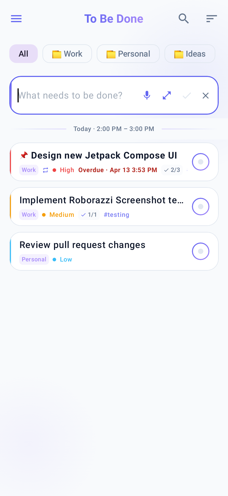
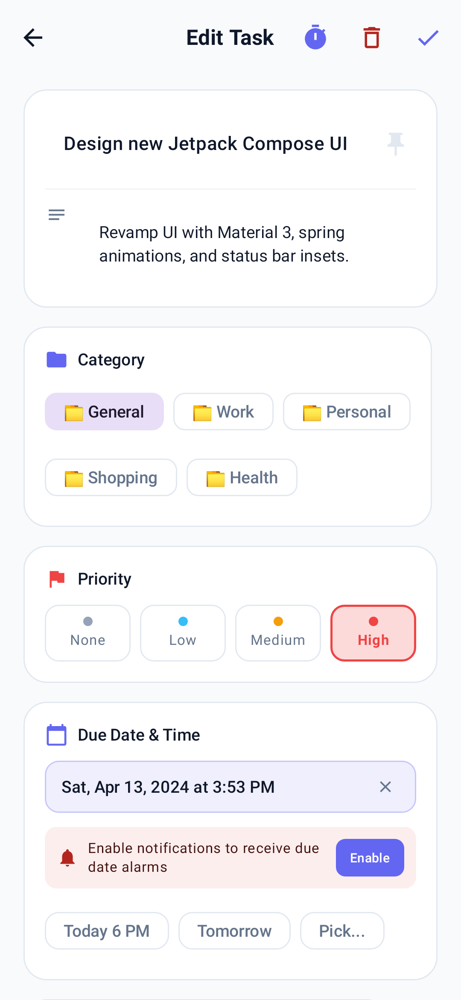
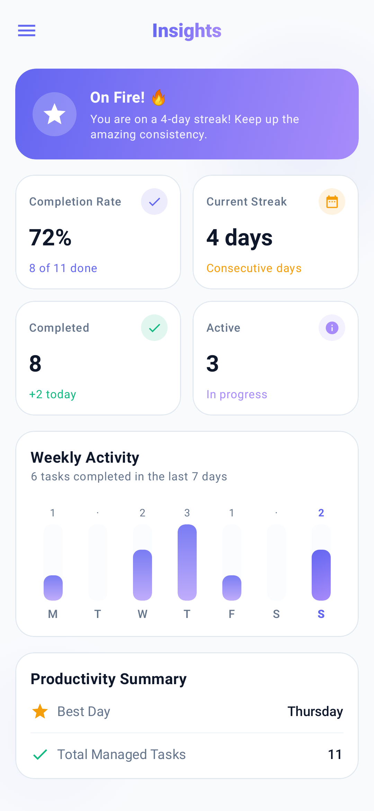

# mTodo

A modern, minimalist, and lightweight Todo app for Android built entirely with **Jetpack Compose** and **Material 3**.

<p align="center">
  
  
  
  
</p>

---

## 📸 Screenshots

<p align="center">
  
  &nbsp;&nbsp;
  
  &nbsp;&nbsp;
  
</p>

<p align="center">
  
  &nbsp;&nbsp;
  
  &nbsp;&nbsp;
  
</p>

---

## ✨ Features

- **Modern Jetpack Compose UI**: 100% declarative UI built with Material 3, dynamic cards, and soft indigo/violet accents.
- **Inline Task Creation**: Fast and non-intrusive inline drafting card at the top of the list — tap Enter or click away to save immediately.
- **Tag & Priority Filter Carousel + Search**: Instantly filter tasks by tag, priority (High, Medium, Low), or overdue status with horizontal filter chips and real-time search.
- **Swipe-to-Action with Undo Snackbar**: Smooth gestures on active tasks (swipe right to complete, swipe left to delete) and done tasks (swipe right to restore, swipe left to delete) with an instant Undo snackbar.
- **Flexible Task Sorting**: Sort tasks on the fly or choose a global default in settings: Creation Date, Priority (High &rarr; Low), Due Date, or Alphabetical.
- **Subtasks & Checklist System**: Break down complex tasks into subtasks with toggle checkboxes, interactive progress bar, and badge indicators on list rows.
- **Due Date Reminders & System Notifications**: Exact alarms scheduled via `AlarmManager` with high-priority Android notifications and inline "Mark Done" action.
- **Data Backup & Restore**: Full local JSON backup and restore via Android's Storage Access Framework (SAF) with merge or overwrite options.
- **Home Screen App Widget**: Clean, glanceable Material 3 widget displaying pending tasks directly on your launcher with a quick "Add" shortcut.
- **Rich Task Metadata**:
  - **Priority System**: High, Medium, Low, and None with distinct color indicators across lists and analytics.
  - **Due Dates & Times**: Due date badges with overdue indicators and quick presets (Today 6 PM, Tomorrow 9 AM, Custom).
  - **Tagging System**: Organize tasks with custom tags and quick tag chips.
  - **Detailed Descriptions**: Add detailed notes and descriptions to tasks.
- **Dedicated Task Details & Edit Screen**: View and modify task metadata, check off subtasks, or inspect completed task history in read-only mode.
- **Smart Date Segmentation**: Automatically groups active tasks into **Today**, **Yesterday**, and **Older** sections with sticky headers.
- **Task Statistics & Completion Insights**: Real-time productivity metrics, completion rates, daily consistency streaks, 7-day visual activity bar chart, and priority distribution breakdown.
- **Fluid Spring Animations & Symmetric Navigation**: Smooth item insertion, completion, and reordering animations powered by Compose `animateItem()`, plus directional slide transitions between tabs.
- **Edge-to-Edge Dark & Light Mode**: Seamless theme switching with system-default and user-selected appearance options, with clear status bar contrast in both modes.
- **Modern Adaptive Launcher & Splash**: Crisp indigo/violet vector branding on Android 12+ splash screen and app icons.
- **Multilingual Support**: Fully localized in English (`en`) and Persian (`fa`).
- **Offline-First Persistence**: Local Room SQLite storage (v4 migration) with reactive Kotlin `Flow` observables and zero cloud tracking.
- **Target SDK 36**: Optimized for Android 16 with security and performance improvements.
- **Comprehensive Automated Test Suite**:
  - Unit tests for ViewModels, Notifications, and Repositories with MockK & Coroutines Test.
  - In-memory Room database integration and migration tests.
  - Roborazzi Compose screenshot tests with pixel-accurate baseline goldens.

---

## 🛠 Tech Stack & Architecture

- **UI Framework**: [Jetpack Compose](https://developer.android.com/jetpack/compose) + [Material 3](https://m3.material.io/)
- **Architecture**: MVVM / Clean Architecture (UI &rarr; ViewModel &rarr; Repository &rarr; Room DAO)
- **Asynchronous / Reactive**: Kotlin Coroutines & `Flow` / `LiveData`
- **Dependency Injection**: [Koin](https://insert-koin.io/)
- **Local Storage**: [Room Database](https://developer.android.com/training/data-storage/room) (SQLite v4)
- **Screenshot & Regression Testing**: [Roborazzi](https://github.com/takahirom/roborazzi) + Robolectric Native Graphics
- **Build System**: Gradle 8.9, Android Gradle Plugin 8.7.3, Kotlin 2.0.21, and Gradle Version Catalog (`libs.versions.toml`)

---

## 🧪 Running Tests

Ensure your `JAVA_HOME` points to Java 17+:

```bash
export JAVA_HOME="/Applications/Android Studio.app/Contents/jbr/Contents/Home"
```

### Run Unit & Integration Tests:
```bash
./gradlew testDebugUnitTest
```

### Verify Roborazzi Screenshot Goldens:
```bash
./gradlew verifyRoborazziDebug
```

### Update Baseline Screenshot Goldens:
```bash
./gradlew recordRoborazziDebug
```

---

## 🗺 Roadmap

- [x] Modernize UI with Jetpack Compose & Material 3
- [x] Basic CRUD on tasks
- [x] Inline task drafting UX
- [x] Priority system (High / Med / Low / None)
- [x] Due dates, times, and tags metadata
- [x] Dedicated task detail and edit screen
- [x] Time period segmentation (Today / Yesterday / Older)
- [x] Task statistics & completion insights + priority distribution
- [x] Dark & Light themes with high-contrast status bars
- [x] Multilingual support: `en`, `fa`
- [x] Tag & Priority filter carousel + real-time search
- [x] Swipe-to-Action with Undo snackbars
- [x] Sorting (Date, Priority, Due Date, Alphabetical)
- [x] Subtasks / checklist support with progress badges
- [x] Due date reminders & system notifications
- [x] Native JSON backup & restore
- [x] Home screen app widget
- [x] Automated unit, integration, and Room database test coverage
- [x] Roborazzi screenshot testing suite
- [x] Target SDK 36 compliance

