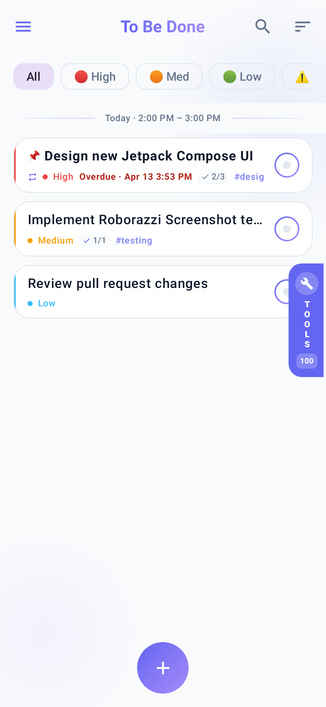
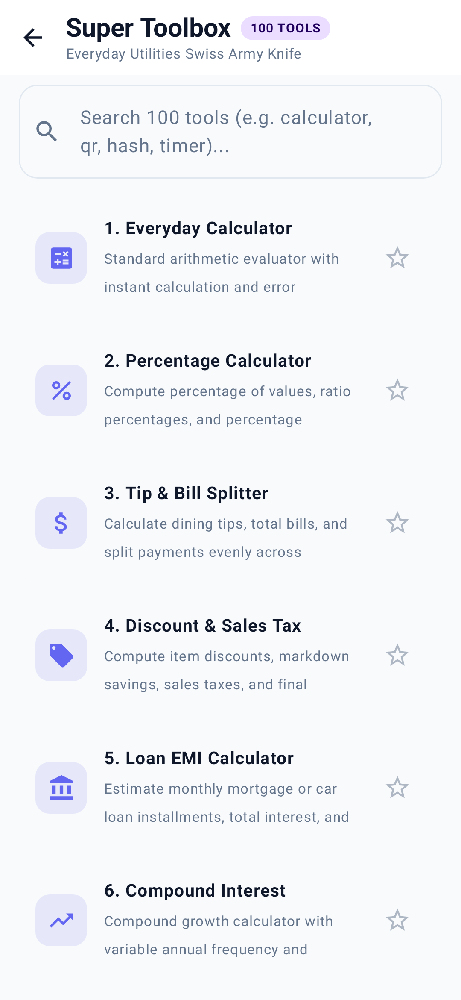
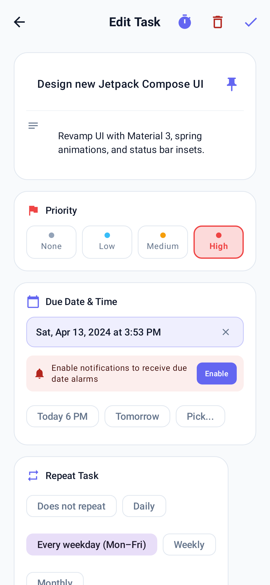
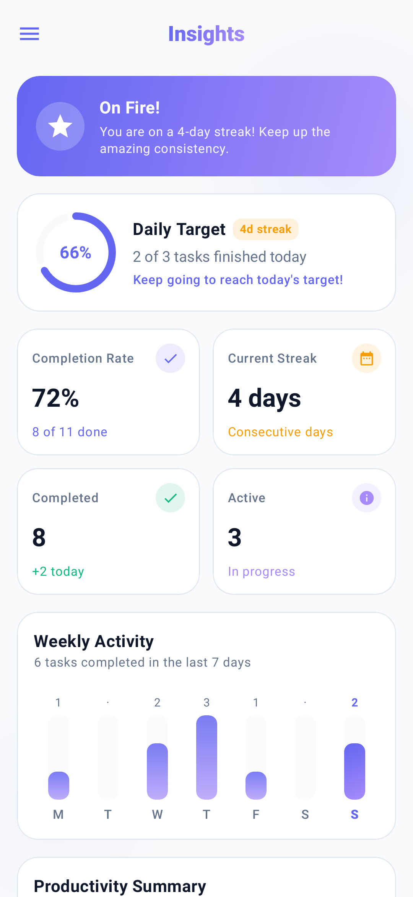
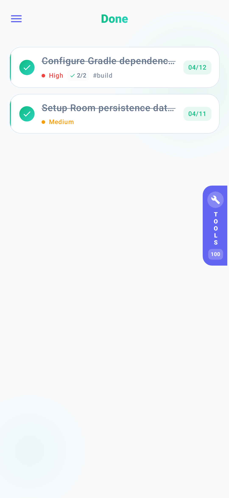
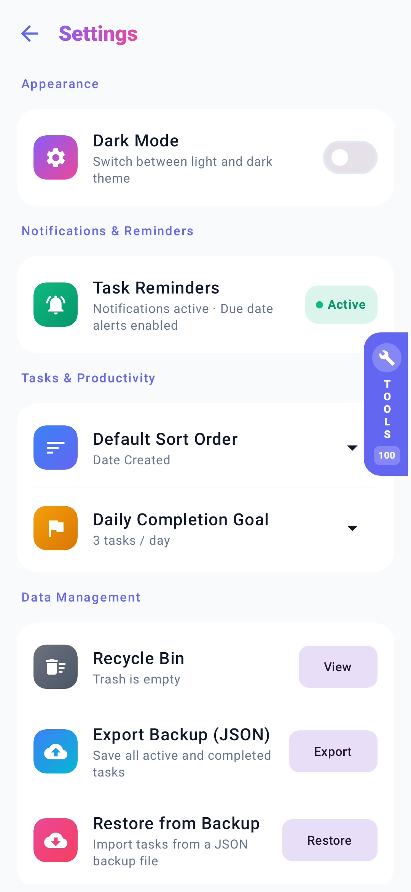

# mTodo

A modern, offline-first Todo and **100 Utilities Super App** for Android built with **Jetpack Compose** and **Material 3**.

<p align="center">
  
  
  
  
</p>

---

## 📸 Screenshots

<p align="center">
  
  &nbsp;&nbsp;
  
  &nbsp;&nbsp;
  
</p>

<p align="center">
  
  &nbsp;&nbsp;
  
  &nbsp;&nbsp;
  
</p>

---

## ✨ Highlights

### 📋 Distraction-Free Task Management
- **High-Visibility Priority Filters**: Instant filtering by `🔴 High`, `🟠 Med`, `🟢 Low`, and `⚠️ Overdue`.
- **Pinned Tasks & Inline Add**: Anchor urgent tasks to top; create tasks quickly with inline drafting.
- **Subtasks & Checklists**: Break down tasks with interactive progress indicators.
- **Smart Recurrence**: Auto-repeating tasks (`Daily`, `Weekdays`, `Weekly`, `Monthly`).
- **Focus Timer**: Built-in 25-minute Pomodoro timer in task details.
- **Actionable Notifications**: Tray buttons (`✓ Done`, `⏰ +15m`, `⏰ +1h`) with exact alarms.
- **Launcher Widget & Multi-Select**: Check off tasks from your home screen or batch-manage items.
- **30-Day Recycle Bin**: Safe soft-deletion with instant recovery or automated 30-day purge.

### 🛠 100 Offline Utilities Super Toolbox
- **Quick-Access Vertical Edge Tab**: Sleek 90° rotated side tab for 1-tap Toolbox access anywhere.
- **100 Interactive Tools (20 per domain)**:
  - **Math & Finance**: Calculators, Unit Converters (Length, Weight, Temp, etc.), Tip Splitter, Loan EMI, Margins.
  - **Text & Code**: Word Counter, Case Converter, Hashes (MD5/SHA), Base64, UUIDs, JSON Formatter, Markdown.
  - **Time & Calendar**: Precision Stopwatch, Multi-Timer, Interval HIIT, World Clock, Moon Phase, Tap BPM.
  - **Hardware & System**: Screen Lantern, Flashlight, Battery Telemetry, Sensors, Level, Refresh Rate, Volume.
  - **Everyday & Health**: Coin Flip, Dice, Random Numbers, QR & Barcode Generator, BMI, Breathing Guide.

### 🔒 Private & Offline-First
- 100% local Room SQLite database with reactive Kotlin `Flow` observables.
- Zero tracking, zero third-party telemetry, full JSON export & restore via SAF.
- Android 15 optimized (Target SDK 36), minimal battery impact, and under 10 MB bundle size.

---

## 🛠 Tech Stack

- **UI**: [Jetpack Compose](https://developer.android.com/jetpack/compose) + [Material 3](https://m3.material.io/)
- **Architecture**: MVVM / Clean Architecture (UI &rarr; ViewModel &rarr; Repository &rarr; Room DAO)
- **Concurrency**: Kotlin Coroutines & `Flow`
- **DI**: [Koin](https://insert-koin.io/)
- **Storage**: [Room Database](https://developer.android.com/training/data-storage/room) (SQLite v5)
- **Testing**: [Roborazzi](https://github.com/takahirom/roborazzi) (Native Graphics) + JUnit4 + MockK

---

## 🧪 Testing

```bash
# Run 67 automated unit & functional tests
./gradlew testDebugUnitTest

# Verify 20 Roborazzi screenshot goldens
./gradlew verifyRoborazziDebug

# Re-record golden screenshots
./gradlew recordRoborazziDebug
```
